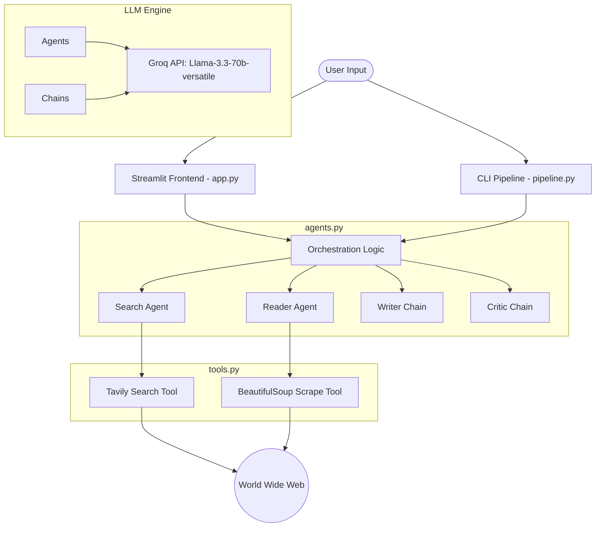
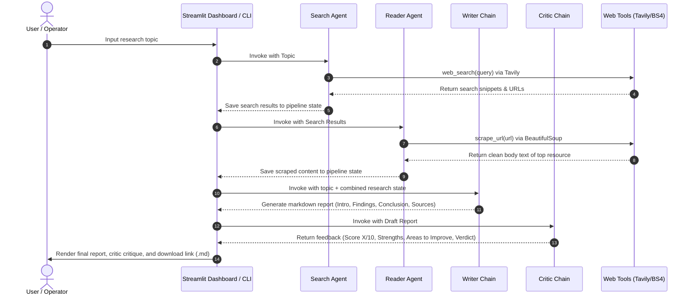

# ResearchMind 

ResearchMind is a highly optimized, state-of-the-art **Multi-Agent AI Research System** that automates the entire process of information retrieval, content analysis, report drafting, and editorial review. 

By orchestrating specialized AI agents and structured chains, ResearchMind performs web searches, extracts deep content from top sources, drafts a professional-grade research report, and critiques it for factual density and structural integrity—all within seconds.

---

## 🏗️ Architecture Diagram

The system is decoupled into user interfaces, an orchestration layer, specialized agents/chains, and external tool integrations.



---

## 🔄 Execution Flow Diagram

The research pipeline executes in a sequential, feedback-driven flow. Here is the step-by-step lifecycle of a research request:



---

## 🛠️ Technology Stack

- **Orchestration & LLM Interface**: [LangChain](https://github.com/langchain-ai/langchain) & `langchain-groq`
- **Large Language Model**: Llama 3.3 70B (`llama-3.3-70b-versatile` hosted on Groq for ultra-low latency inference)
- **Web Search API**: [Tavily Client](https://tavily.com/) (engineered specifically for AI agent web searching)
- **Web Scraping**: `BeautifulSoup4` & `Requests` (with customized noise cleaning for boilerplate content like headers, footers, scripts)
- **Frontend Dashboard**: [Streamlit](https://streamlit.io/) (with a customized, premium dark-mode custom-themed UI)

---

## 📁 Repository Structure

```bash
├── agents.py          # Definition of Search/Reader agents and Writer/Critic chains
├── app.py             # Streamlit-based graphical user interface & runner
├── pipeline.py        # CLI-based runner & execution pipeline
├── tools.py           # Web search (Tavily) & scraping (BeautifulSoup4) tools
├── requirements.txt   # Python package dependencies
└── .env               # API credentials and environment configurations
```

---

## 🚀 Getting Started

### 1. Prerequisites
- **Python**: version `3.10` or higher
- **Groq API Key**: Get it from [Groq Console](https://console.groq.com/)
- **Tavily API Key**: Get it from [Tavily Console](https://tavily.com/)

### 2. Installation

1. **Clone the repository** (or navigate to your project directory):
   ```bash
   cd "Multi Agent Research System"
   ```

2. **Create a virtual environment & activate it**:
   ```bash
   # On Windows
   python -m venv .venv
   .venv\Scripts\activate

   # On macOS/Linux
   python3 -m venv .venv
   source .venv/bin/activate
   ```

3. **Install the dependencies**:
   ```bash
   pip install -r requirements.txt
   ```

### 3. Environment Variables Configuration

Create a `.env` file at the root of the project with the following keys:

```ini
GROQ_API_KEY="your-groq-api-key"
TAVILY_API_KEY="your-tavily-api-key"
```

---

## 💻 Usage

### Option A: Streamlit Graphical UI (Recommended)
Launch the premium web-based dashboard:
```bash
streamlit run app.py
```
*Open [http://localhost:8501](http://localhost:8501) in your browser. Enter a topic, watch the visual step-by-step progress cards, read the generated reports, view critic scoring, and download the output as a Markdown file.*

### Option B: Command Line Interface (CLI)
Run the pipeline directly in your terminal:
```bash
python pipeline.py
```
*Follow the interactive prompt to enter your topic, and watch the real-time pipeline print outputs for each step.*

### Measure real pipeline latency
With your API keys configured, run five end-to-end requests and collect real
timings from the search, reader, writer, and critic workflow:
```bash
python benchmark_pipeline.py
```
The benchmark prints the time for every query, then reports the average and
fastest-to-slowest range. It makes real API and web-tool calls, so results vary
with provider latency, source availability, and report length. For a report or
demo, use the final `Report-ready` line rather than a single run.

To benchmark your own representative workload, provide five to ten quoted
topics:
```bash
python benchmark_pipeline.py "AI regulation in India" "Recent battery recycling advances" "Urban heat adaptation" "Quantum error correction" "Precision agriculture"
```
